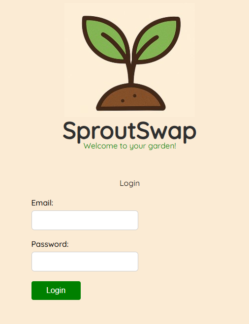
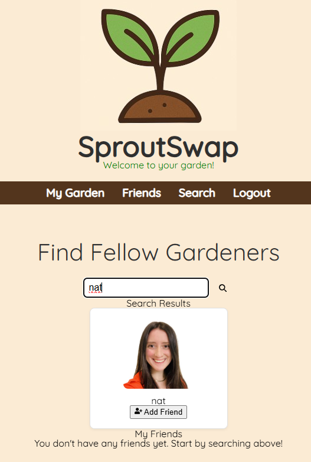
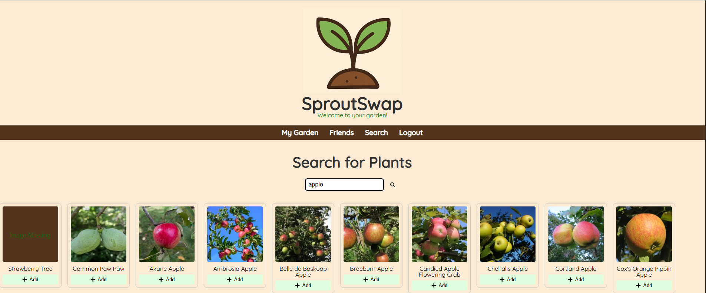
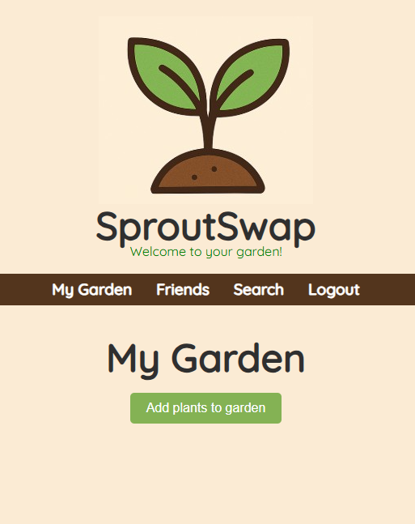

# SproutSwap
A community-driven plant care and swapping platform for gardening enthusiasts.

## Description
SproutSwap is a plant-sharing app that lets users add and save plants to their virtual garden, connect with fellow plant enthusiasts, and browse each other's gardens. 

The platform fosters a community of plant lovers where users can easily swap plants based on what they have available, helping everyone grow their collections and share the joy of gardening.

Users can create a profile & browse plants, clicking in to learn more. They have the option to add or delete plants in their personal garden. They also have the option to search for other users, view their gardens, and add them as friends. 

## Table of Contents
- [Installation](#installation)
- [Usage](#usage)
- [License](#license)
- [Contributing](#contributing)
- [Tests](#tests)
- [Questions](#questions)

## Installation
Clone the repo from github and then run npm -i to install the needed packages. MongoDB is required for this application, so run npm run seed. This application utilizes the perenual API, so you will need to get an API KEY from https://perenual.com/register?. 

This information will require a .env file, with the below fields: 
MONGODB_URI='<your info here>'
JWT_SECRET_KEY='<your info here>'
PERENUAL_API_KEY='<your info here>'

## Usage
To start the program, run npm start in the integrated terminal.

## License
This project is licensed under the MIT license.

## Contributing
Dan Musser, Ike Yates, Lazuli Salciccioli, and Natalie Gindraux. For those who want to add to this project, please contact us on Github.

## Tests
To test that this is working, run npm start and test functionality on the site. You can test queries directly in Apollo. To access Apollo, you'll need to use the login mutation to retrieve your authentication token. Once you have the token, include it in your request headers as follows: 
    {
        "authorization": "Bearer YOUR_TOKEN_HERE"
    }

To login to the site, you can use: 
    email: nat@gmail.com
    password: password
## Questions
If you have any questions, please find us on GitHub at https://github.com/musserdn/SproutSwap
    [musserdn](https://github.com/musserdn).
    [IkeAlmighty](https://github.com/IkeAlmighty).
    [kerriamber](https://github.com/kerriamber).
    [ngin2894](https://github.com/ngin2894).
